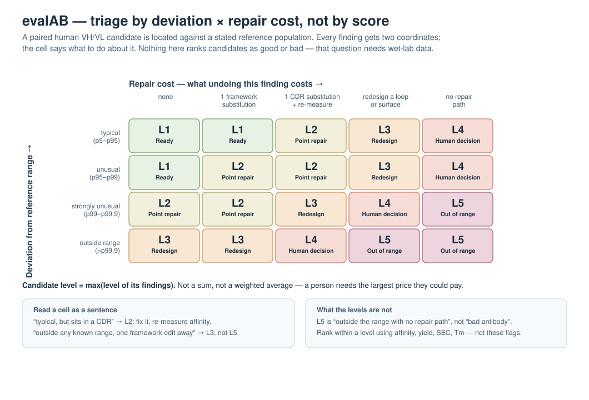

# evalAB

**Range-and-repair triage for paired human antibody variable domains.**

evalAB takes a batch of paired human VH/VL sequences and sorts them by *what
you would have to do next*. It does not score them, rank them, or predict
whether they will work.



---

## The one-paragraph version

Every finding on a candidate gets two coordinates: **how far outside a stated
reference range it sits**, and **what it would cost to repair**. Those two
numbers select a cell in a fixed 4×5 table, and the cell names an action. The
candidate's level is the maximum over its findings — the largest price it could
make you pay. There are no weights, no summed score, and no good/bad axis
anywhere in the pipeline.

That design is a consequence of a measurement, not a preference. The only
outcome-like labels available in public antibody data are provenance contrasts
— "reached the clinic" versus "was merely patented" — and a classifier built on
them reaches **AUC 0.587**. Statistically real; practically nothing. A
repository holding no wet-lab outcomes cannot tell you which antibody is good,
so this one does not pretend to. It answers the question it can answer: *where
does this candidate sit relative to antibodies we have seen, and what would
moving it cost?*

---

## What the levels mean

| Level | Name | What to do |
|---|---|---|
| **L1** | Ready | Put it on the wet-lab list as it stands. |
| **L2** | Point repair | One or two substitutions first; re-measure affinity if any is in a CDR. |
| **L3** | Redesign | A loop or a surface has to be redesigned — budget a design cycle, not a mutation. |
| **L4** | Human decision | Nothing routes this automatically; a person decides whether it is worth the bench time. |
| **L5** | Out of range | Outside the reference range with no repair path — the flag names which boundary. |

Two corners of Figure 1 are worth reading carefully, because they are where a
pass/fail gate would get it wrong:

- **Outside any known range, but one framework substitution away → L3, not
  L5.** A pI beyond anything in the reference population is not a dead
  candidate. It is a candidate with a known price.
- **Entirely typical, but sitting in a CDR → L2.** An ordinary deamidation
  motif is ordinary right up until it is in a loop you are about to re-measure.

**L5 is not "bad antibody".** It means "outside the stated range with no repair
path I can name". Both halves of that sentence are about the reference
population and the repair scale — not about the molecule's merit.

For what each individual finding measures — the biology behind it, the tool
that produces it, and the highest level it can drive on its own — see
[docs/metrics.md](docs/metrics.md).

---

## Quick start

```bash
conda env create -f environment.yml
conda activate evalab
pip install -e .
```

Screen a CSV with `candidate_id,vh_sequence,vl_sequence`:

```bash
python -m antibody_prescreen data/example/demo_batch.csv
```

Reproduce the shipped example output exactly:

```bash
python -m antibody_prescreen data/example/demo_batch.csv --out /tmp/out.md
diff /tmp/out.md data/example/demo_report.md && echo "reproduced"
```

From Python:

```python
from antibody_prescreen import screen_batch, provenance, format_report, load_default_bands

bands = load_default_bands()
results = screen_batch([
    {"candidate_id": "design-01", "vh_sequence": VH, "vl_sequence": VL},
])
print(format_report(results, run_provenance=provenance(results, bands)))
```

Every report opens with a provenance header, and that is not decoration:

```
### Run provenance

- Reference bands: PLAbDab (all pairings) + PLAbDab/TheraSAbDab (clinical-stage)
  for vh_germline_identity, vl_germline_identity (fit n=29147, validation n=29030,
  cuts p5/p95/p99/p99.9)
- Numbering: 20/20 candidates numbered (100.0%)
- Metrics with no reference band (unmeasured, NOT typical): none
```

A level is uninterpretable without the population that defined the range, and a
batch summary is misleading without the share of candidates that failed to
number at all. **"Unmeasured" never means "fine"** — it means nothing looked.

---

## Scope, stated narrowly on purpose

evalAB accepts **complete, paired, human VH/VL**. That is one variable heavy
domain and one variable light domain, full length, human germline.

Anything else is reported as a scope finding rather than silently screened. A
mouse-germline VH routes to L4 with the reason attached, because every band was
fitted on human antibodies and simply does not describe it. In the shipped
20-candidate demo, 9 of 20 land at L4 — most of them for exactly this reason.
That is the scope guard working, not a defect.

Out of scope: single domains and nanobodies, scFv linkers, Fc and constant
regions, bispecific formats, non-human and humanised-with-back-mutation
sequences, unpaired chains.

---

## Repository layout

```
antibody_prescreen/        the package
  screen.py                PUBLIC API — screen_candidate, screen_batch,
                           provenance, format_report
  __main__.py              CLI (python -m antibody_prescreen)
  numbering.py             ANARCI / IMGT; the only place CDR boundaries are decided
  profile.py               measure a candidate; no thresholds applied here
  bands.py                 what "outside the common range" means, and from which population
  levels.py                the deviation × repair-cost matrix
  developability.py        AGGRESCAN, pI, net charge — raw numbers only
  calibration/             refit bands to another population; never runs at screening time
  structure/               optional Tier 2 (ABodyBuilder2 + TAP), off by default
  data/*.json              the shipped band files, each recording its own provenance

data/reference/            public reference data — fetched, checksummed, not committed
data/example/              a reproducible 20-candidate demo batch and its exact output
docs/
  metrics.md               every metric: biology, tool, repair cost, level it can drive
  range-triage-design.md   why this is a triage and not a score, with the measurements
  calibration.md           how to make it yours: refit, pre-register, rank, generative designs
assets/figure-1-triage.svg Figure 1, generated from the matrix in levels.py
examples/screen_designs.py thin wrapper over the public API; sealed-holdout comparison
tests/                     23 tests, offline
tbd/                       archived earlier experiments — NOT current behaviour
```

The public API is `antibody_prescreen.screen`. Everything else is an
implementation detail you are welcome to read and should not need to call.

---

## Making it yours

The shipped bands describe a public antibody population. They cannot tell you
whether a candidate will express, purify, or stay monomeric **in your hands**,
because no result from your bench is in them. [`docs/calibration.md`](docs/calibration.md)
covers the four things worth doing about that:

1. **Refit the bands** to whatever reference population answers your question.
   The reference is a parameter, not a fact — and the choice imports a bias
   that the band file then records.
2. **Calibrate against your own results**, with the endpoints, thresholds and
   holdout written down *before* the batch runs. Moving a threshold after
   seeing the outcomes and calling the result a validation is the single
   easiest way to fool yourself here.
3. **Rank within a level using project data** — affinity, expression yield, SEC
   monomer, Tm, polyreactivity, cell activity. evalAB deliberately offers no
   tiebreak inside L1–L3, because the only tiebreak it *could* offer is a
   re-weighted composite of sequence flags, which is the thing this design
   rejects.
4. **Give generative designs their own reference.** A poly-residue run is rare
   in natural and clinical antibodies because of how B-cell repertoires and
   development pipelines work. A de novo sampler has none of that behind it, so
   the natural-population frequency does not transfer. Fit bands on your
   generator's own output and compare a design against its own kind.

`--shared-scaffold` is worth knowing about for variant batches. Because the
level is a max, a liability the parent scaffold already carried appears in every
candidate and saturates the level for the whole batch — true of each candidate,
useless for choosing between them. The flag adds an introduced-only view that
sets the shared findings aside. It is an explicit declaration, never inferred:
declaring it for an unrelated batch produces a view with no meaning.

---

## Tier 2 (structure) is an annotation, not a verdict

`--run-structure` builds an ABodyBuilder2 model and runs TAP. It is **off by
default** and, when on, **never changes a Tier 1 level**.

TAP's own AMBER/RED lines were drawn around the distribution of known
therapeutic antibodies, so measuring them against known therapeutic antibodies
measures the same ruler twice — here it returned likelihood ratios of 1.00 to
2.43. The range-based workflow has no independent outcome validation of what
TAP contributes to *it*. Treat it as a closer look at a short list you already
care about, at minutes per candidate rather than milliseconds.

---

## Honest limitations

- **No wet-lab outcomes anywhere in this repository.** Every band is a
  description of a sequence population. Nothing here has been shown to predict
  expression, aggregation, or immunogenicity in a real experiment.
- **The reference population imports its own bias.** A clinical reference means
  "the range of things that survived development" (survivorship); the full
  patent corpus means "the range of things that are antibodies" (no filter at
  all). Neither is right in the abstract, and the band file records which was
  used.
- **"Human" is ANARCI's germline call, not a provenance record.** A humanised
  antibody with murine back-mutations passes the filter.
- **Percentile cut points are conventions.** p95/p99/p99.9 were chosen so the
  union of all metrics clears a stated budget, not because any one of them
  marks a physical boundary.
- **Tier 2 has no independent validation** in this workflow, which is why it
  cannot move a level.

---

## Tests

```bash
python -m pytest tests/ -q     # 23 tests, fully offline
```

`tbd/` holds an earlier weighted-score implementation and its calibration
reports, kept for provenance. It is outside the import path, the test suite and
the public workflow, and nothing in it describes current behaviour.

---

## Citation and licence

evalAB is MIT-licensed (see [LICENSE](LICENSE)). Reference data fetched into
`data/reference/` carries its own terms — see
[data/reference/README.md](data/reference/README.md), which pins the URL,
checksum and retrieval date.

If the range bands matter to your work, cite the reference population as well:
Abanades et al., *PLAbDab: a database of printed and published antibodies*,
Nucleic Acids Research (2024).
